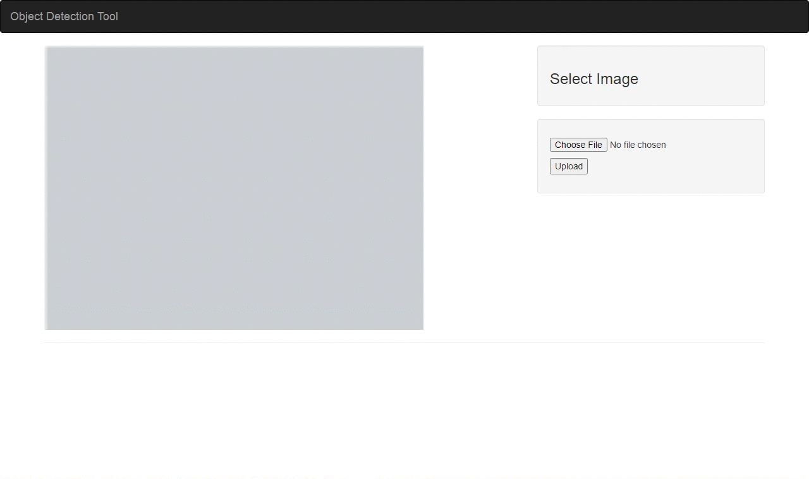

# Object-Detection-App
Detect objects in image using Yolo and Opencv

## Installing dependencies
#### Install Python 3
#### Install Numpy (pip install numpy)
#### OpenCV Python bindings (pip install opencv-python)

## Download Yolov3.weights file and add it to the 'lib' directory
#### You can download Yolov3.weights file from the Darknet webpage at: https://pjreddie.com/media/files/yolov3.weights 

